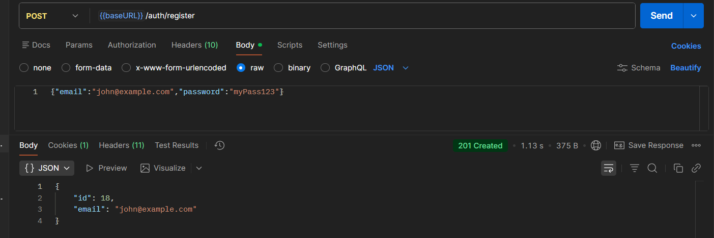
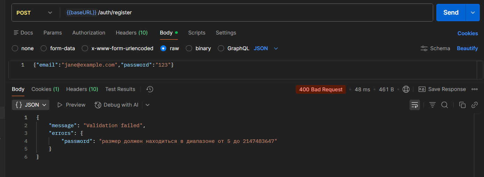
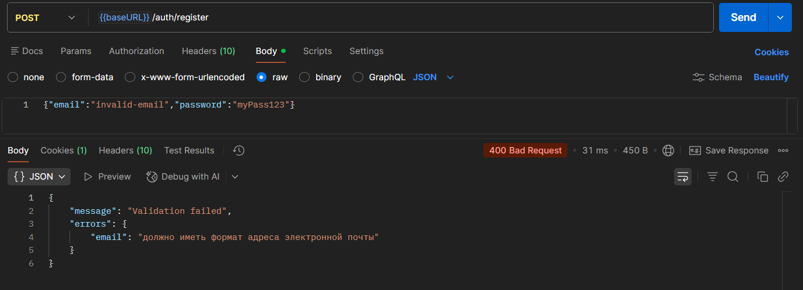
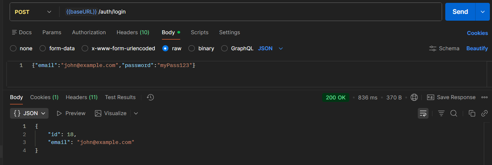
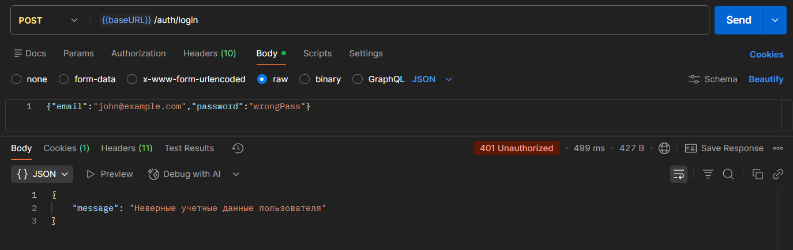
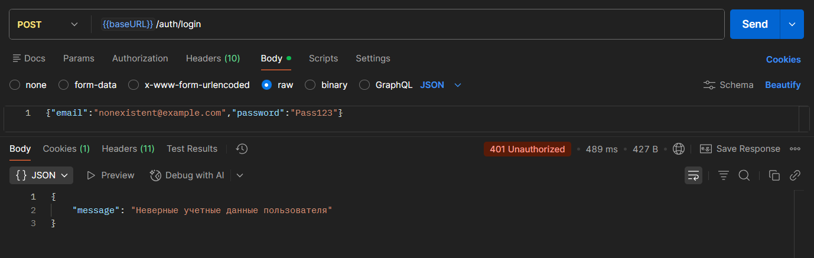

# Практическое занятие №9: Аутентификация и авторизация в Spring Boot

## Выполнил: Туев Д. ЭФМО-01-25

## Описание проекта

REST API сервис с реализацией механизма аутентификации и авторизации пользователей на основе Spring Security. Система поддерживает регистрацию новых пользователей, вход в систему (логин), и разграничение доступа на основе ролей (USER, ADMIN). Пароли хранятся в зашифрованном виде с использованием BCrypt. Проект реализован на базе Spring Boot 3.5.7 с использованием PostgreSQL для хранения данных пользователей, Spring Security для управления аутентификацией и авторизацией.

### Стек технологий

В проекте используются следующие технологии и инструменты:
- **Spring Boot 3.5.7** — основной фреймворк приложения
- **Spring Web** — для разработки REST API
- **Spring Security** — управление аутентификацией и авторизацией
- **Spring Data JPA** — интеграция с PostgreSQL через Hibernate
- **Spring Validation** — валидация входных данных
- **PostgreSQL** — реляционная база данных для хранения пользователей
- **BCrypt** — хеширование паролей (part of Spring Security)
- **Lombok** — сокращение шаблонного кода
- **Maven** — управление зависимостями и сборка проекта
- **Java 17** — язык программирования

### Поддерживаемые запросы

**Легенда:** 🔓 Открытый доступ · 🔒 Требуется аутентификация · 👥 USER/ADMIN · 🛡️ Только ADMIN

| Метод | Эндпоинт | Параметры | Действие | Ответ | Требования | Тело ответа |
|-------|----------|-----------|----------|-------|-----------|-------------|
| 🔓 **POST** | `/auth/register` | - | Регистрация пользователя | `201 CREATED` | Нет | `JSON` объект UserDTO |
| 🔓 **POST** | `/auth/login` | - | Вход в систему | `200 OK` | Нет | `JSON` объект UserDTO |

### Формат данных

Тело запроса (POST /auth/register):
```json
{
  "email": "user@example.com",
  "password": "securePassword123"
}
```

Тело запроса (POST /auth/login):
```json
{
  "email": "user@example.com",
  "password": "securePassword123"
}
```

Ответ (POST /auth/register, POST /auth/login):
```json
{
  "id": 1,
  "email": "user@example.com"
}
```

### Структура проекта

```
my/learn/mireaffjpractice9/
├── config/
│   └── SecurityConfig.java                     # Конфигурация Spring Security
├── controller/
│   ├── AuthController.java                     # REST API для регистрации и логина
│   └── UserController.java                     # Контроллер для защищённых ресурсов
├── dto/
│   ├── request/
│   │   ├── UserRegisterRequest.java            # DTO для регистрации
│   │   └── UserLoginRequest.java               # DTO для логина
│   └── responce/
│       └── UserDTO.java                        # DTO пользователя для ответов
├── exception/
│   ├── AppException.java                       # Базовое исключение приложения
│   ├── UserAlreadyExistException.java          # Исключение при дублировании email
│   └── handler/
│       └── MyExceptionHandler.java             # Глобальный обработчик ошибок
├── model/
│   ├── User.java                               # JPA Entity пользователя (UserDetails)
│   └── UserRole.java                           # Enum ролей (USER, ADMIN)
├── repository/
│   └── UserRepository.java                     # JPA репозиторий пользователей
├── service/
│   ├── UserService.java                        # Interface сервиса пользователей
│   └── UserServiceImpl.java                     # Реализация с UserDetailsService
├── util/
│   └── UserMapper.java                         # Маппер для преобразования User -> UserDTO
└── MireaFfjPractice9Application.java           # Главный класс приложения
```

## Тестирование

Рекомендуется использовать Postman для тестирования API. Для данного проекта предусмотрена [коллекция запросов](https://lively-flare-564043.postman.co/workspace/My-Workspace~fe2081e8-b325-4776-8b48-400d41f5b4bd/collection/42992055-42a59dfd-3dd4-4116-abf5-8af583ae3615?action=share&creator=42992055).

### Обработка ошибок и коды ответа

| Код | Название | Где обрабатывается | Что значит / когда возвращается |
| :-- | :-- | :-- | :-- |
| 200 | OK | `/auth/login` | Успешная операция. |
| 201 | Created | `/auth/register` | Пользователь успешно зарегистрирован. |
| 400 | Bad Request | `/auth/register`, `/auth/login` | Некорректные данные (email невалиден, пароль короче 5 символов). |
| 401 | Unauthorized | `/auth/login`, защищённые эндпоинты | Неверные учётные данные или отсутствует аутентификация. |
| 409 | Conflict | `/auth/register` | Email уже зарегистрирован в системе. |
| 500 | Internal Server Error | `MyExceptionHandler` | Непредвиденная ошибка сервера. |

### Тест кейсы

| № | Наименование | Маршрут | Запрос (пример) | Ожидаемый ответ |
|--|--|--|--|--|
| 1 | Регистрация нового пользователя | **POST /auth/register** | `{"email":"john@example.com","password":"myPass123"}` | 201 Created + JSON UserDTO |
| 2 | Регистрация с коротким паролем | **POST /auth/register** | `{"email":"jane@example.com","password":"123"}` | 400 Bad Request |
| 3 | Регистрация с невалидным email | **POST /auth/register** | `{"email":"invalid-email","password":"myPass123"}` | 400 Bad Request |
| 4 | Регистрация дублирующегося email | **POST /auth/register** | `{"email":"john@example.com","password":"Pass123"}` | 409 Conflict |
| 5 | Вход с правильными данными | **POST /auth/login** | `{"email":"john@example.com","password":"myPass123"}` | 200 OK + JSON UserDTO |
| 6 | Вход с неверным паролем | **POST /auth/login** | `{"email":"john@example.com","password":"wrongPass"}` | 401 Unauthorized |
| 7 | Вход с несуществующим email | **POST /auth/login** | `{"email":"nonexistent@example.com","password":"Pass123"}` | 401 Unauthorized |

### Результаты тестирования

#### 1. Регистрация нового пользователя



Результат: **HTTP 201 Created**, пользователь успешно зарегистрирован с хешированным паролем.

#### 2. Регистрация с коротким паролем



Результат: **HTTP 400 Bad Request**, пароль должен быть минимум 5 символов.

#### 3. Регистрация с невалидным email



Результат: **HTTP 400 Bad Request**, email не соответствует формату.

#### 4. Регистрация дублирующегося email


Результат: **HTTP 409 Conflict**, email уже зарегистрирован.

#### 5. Вход с правильными данными



Результат: **HTTP 200 OK**, пользователь успешно аутентифицирован.

#### 6. Вход с неверным паролем



Результат: **HTTP 401 Unauthorized**, неверные учетные данные пользователя.

#### 7. Вход с несуществующим email



Результат: **HTTP 401 Unauthorized**, неверные учетные данные пользователя.


## Настройка сервера

### Переменные окружения

Для корректной работы приложения необходимо указать следующие переменные окружения:

| Переменная окружения | Описание | Пример |
|----------------------|----------|----------|
| POSTGRES_URL         | URL подключения к PostgreSQL | jdbc:postgresql://localhost:5432/practice9_db |
| POSTGRES_USERNAME    | Имя пользователя БД | postgres |
| POSTGRES_PASSWORD    | Пароль пользователя БД | password |

**Конфигурация в application.properties:**
```properties
spring.datasource.url=${POSTGRES_URL}
spring.datasource.username=${POSTGRES_USERNAME}
spring.datasource.password=${POSTGRES_PASSWORD}
```

## Дополнительно

### Теоретические основы

#### Spring Security и аутентификация

Spring Security — это мощный фреймворк для реализации аутентификации и авторизации в приложениях. Основные концепции:

- **Аутентификация** — проверка подлинности пользователя (who are you?)
- **Авторизация** — проверка прав доступа (what can you do?)
- **Authentication** — объект, содержащий информацию об аутентифицированном пользователе
- **GrantedAuthority** — право/роль, которым обладает пользователь

#### UserDetails и UserDetailsService

- **UserDetails** — интерфейс, который должны реализовывать Entity пользователей
- **UserDetailsService** — сервис для загрузки информации о пользователе по username
- **User** в проекте реализует оба интерфейса для полной интеграции с Spring Security

#### BCrypt и хеширование паролей

BCrypt — это адаптивный хеш-алгоритм для безопасного хранения паролей:

- **Хеширование** — преобразование пароля в невозвратимую строку
- **Salt** — случайное значение, добавляемое к паролю перед хешированием
- **Strength** — параметр сложности (12 в проекте = сложное и медленное хеширование)
- **Верификация** — BCrypt при каждой проверке генерирует новый хеш, но сравнивает правильно

#### SecurityFilterChain и авторизация

SecurityFilterChain — цепь фильтров Spring Security, которая:

- Перехватывает каждый HTTP запрос
- Проверяет аутентификацию
- Проверяет авторизацию на основе путей и ролей
- Позволяет определить правила типа: `/public/**` — открыто, `/admin/**` — только ADMIN

### Ключевые фрагменты кода

#### 1. SecurityConfig с конфигурацией фильтров

```java
@Configuration
@EnableWebSecurity
public class SecurityConfig {

    @Bean
    public SecurityFilterChain securityFilterChain(HttpSecurity http) throws Exception {
        return http
                .csrf(csrf -> csrf.disable())
                .authorizeHttpRequests(authz -> authz
                        .requestMatchers("/", "/auth/**").permitAll()
                        .requestMatchers("/user/**").hasAnyRole(UserRole.USER.name(), UserRole.ADMIN.name())
                        .requestMatchers("/admin/**").hasRole(UserRole.ADMIN.name())
                        .anyRequest().authenticated()
                )
                .build();
    }

    @Bean
    public PasswordEncoder passwordEncoder() {
        return new BCryptPasswordEncoder(12);
    }

    @Bean
    public AuthenticationManager authenticationManager(AuthenticationConfiguration config) throws Exception {
        return config.getAuthenticationManager();
    }
}
```

#### 2. User Entity реализующий UserDetails

```java
@Entity
@Table(name = "users")
@Data
@Builder
public class User implements UserDetails {
    @Id
    @GeneratedValue(strategy = GenerationType.IDENTITY)
    private Long id;

    @Column(unique = true, nullable = false)
    private String email;

    @Column(nullable = false)
    private String passwordHash;

    @Column
    private LocalDateTime createdAt;

    @Column
    private LocalDateTime updatedAt;

    @Override
    public Collection<? extends GrantedAuthority> getAuthorities() {
        return List.of(UserRole.USER);
    }

    @Override
    public String getPassword() {
        return passwordHash;
    }

    @Override
    public String getUsername() {
        return email;
    }
}
```

#### 3. AuthController с регистрацией и логином

```java
@RestController
@RequestMapping("/auth")
@RequiredArgsConstructor
public class AuthController {
    private final UserService userService;
    private final AuthenticationManager authenticationManager;

    @PostMapping("/register")
    public ResponseEntity<UserDTO> registrateNewUser(@Valid @RequestBody UserRegisterRequest request) {
        User saved = userService.save(request);
        return new ResponseEntity<>(UserMapper.mapToDTO(saved), HttpStatus.CREATED);
    }

    @PostMapping("/login")
    public ResponseEntity<UserDTO> login(@Valid @RequestBody UserLoginRequest request) {
        Authentication auth = authenticationManager.authenticate(
                new UsernamePasswordAuthenticationToken(
                        request.getEmail(),
                        request.getPassword()
                )
        );
        User principal = (User) auth.getPrincipal();
        return new ResponseEntity<>(UserMapper.mapToDTO(principal), HttpStatus.OK);
    }
}
```

#### 4. UserServiceImpl реализующий UserDetailsService

```java
@Service
@Transactional
@RequiredArgsConstructor
public class UserServiceImpl implements UserService {
    private final UserRepository userRepository;
    private final PasswordEncoder passwordEncoder;

    @Override
    public User save(UserRegisterRequest req) {
        Optional<User> byEmail = userRepository.findByEmail(req.getEmail());
        if (byEmail.isPresent()) {
            throw new UserAlreadyExistException("User with email " + req.getEmail() + " already exists");
        }
        User user = User.builder()
                .email(req.getEmail())
                .passwordHash(passwordEncoder.encode(req.getPassword()))
                .createdAt(LocalDateTime.now())
                .updatedAt(LocalDateTime.now())
                .build();
        return userRepository.save(user);
    }

    @Override
    public UserDetails loadUserByUsername(String username) throws UsernameNotFoundException {
        return userRepository.findByEmail(username)
                .orElseThrow(() -> new UsernameNotFoundException(username));
    }
}
```

#### 5. Глобальная обработка ошибок аутентификации

```java
@ControllerAdvice
public class MyExceptionHandler {
    
    @ExceptionHandler
    public ResponseEntity<Object> handleException(AuthenticationException exception) {
        HashMap<String, Object> body = new HashMap<>();
        body.put("message", exception.getMessage());
        return new ResponseEntity<>(body, HttpStatus.UNAUTHORIZED);
    }

    @ExceptionHandler
    public ResponseEntity<Object> handleException(AppException exception) {
        HashMap<String, Object> body = new HashMap<>();
        body.put("message", exception.getMessage());
        return new ResponseEntity<>(body, exception.getStatus());
    }
}
```

### Контрольные вопросы

#### 1. Чем отличаются аутентификация и авторизация?

- **Аутентификация** — проверка подлинности (кто вы?)
  - Пользователь предоставляет учётные данные (email, пароль)
  - Spring Security их проверяет и создаёт Authentication объект
  - Результат: либо успех, либо AuthenticationException

- **Авторизация** — проверка прав (что вы можете делать?)
  - Проверяет роли и права пользователя
  - Определяет доступ к конкретным ресурсам
  - Результат: 200 OK либо 403 Forbidden

#### 2. Для чего нужен BCrypt?

BCrypt — адаптивный алгоритм хеширования паролей:

- **Необратимость** — пароль не может быть восстановлен из хеша
- **Salt** — каждый хеш уникален благодаря рандомному salt
- **Медленность** — параметр strength делает хеширование намеренно медленным против brute-force атак
- **Верификация** — `matches(password, hash)` корректно сравнивает пароль с хешем

#### 3. Как работает SecurityFilterChain?

SecurityFilterChain — цепь фильтров, которая обрабатывает каждый запрос:

1. Запрос поступает в цепь фильтров
2. Фильтры проверяют: является ли путь открытым или требует аутентификацию
3. Если требует аутентификацию — проверяется наличие Authentication в контексте
4. Если есть — проверяются роли/права (авторизация)
5. Если всё OK — запрос передаётся контроллеру
6. Если нет — возвращается 401 (неаутентифицирован) или 403 (без прав)

#### 4. Что такое GrantedAuthority и UserRole?

- **GrantedAuthority** — интерфейс для представления прав/ролей
- **UserRole** — enum, реализующий GrantedAuthority для определения ролей (USER, ADMIN)
- Используется для проверки прав: `hasRole("ADMIN")`, `hasAnyRole("USER", "ADMIN")`
- В SecurityConfig используется для разграничения доступа

#### 5. Почему нужен UserDetailsService?

UserDetailsService используется Spring Security для:

- Загрузки информации о пользователе по username (email в этом проекте)
- Получения GrantedAuthority пользователя (роли)
- Работы с Custom User сущностями
- Интеграции с БД для получения информации о пользователе

```java
public UserDetails loadUserByUsername(String username) {
    return userRepository.findByEmail(username).orElseThrow(...);
}
```

#### 6. Что происходит при вызове /auth/login?

1. Клиент отправляет POST с email и password
2. AuthenticationManager создаёт UsernamePasswordAuthenticationToken
3. Spring Security вызывает UserDetailsService.loadUserByUsername(email)
4. Полученный User сравнивается с password через BCrypt
5. Если совпадает — создаётся Authentication с GrantedAuthority
6. Если нет — выбрасывается BadCredentialsException (401 Unauthorized)

#### 7. Как работает @Transactional в UserServiceImpl?

@Transactional аннотация обеспечивает:

- **Транзакционность** — все операции (findByEmail + save) выполняются в одной транзакции
- **Откат при ошибке** — если выбросится исключение, БД откатит изменения
- **Lazy loading** — связанные сущности загружаются в контексте транзакции
- **ACID гарантии** — целостность данных

## Выводы

В результате выполнения практического занятия №9 был разработан REST API сервис с реализацией комплексного механизма аутентификации и авторизации на базе Spring Security. Проект демонстрирует применение лучших практик безопасности в веб-приложениях.

**Достигнутые результаты:**

- Реализована регистрация пользователей с валидацией данных
- Внедрена аутентификация через email и пароль
- Пароли хранятся в хешированном виде с использованием BCrypt
- Реализовано разграничение доступа на основе ролей (USER, ADMIN)
- Настроена SecurityFilterChain для управления авторизацией
- Реализована обработка исключений аутентификации (401, 403)
- Применены DTO для отделения внутреннего представления от API
- User Entity реализует интерфейсы UserDetails и GrantedAuthority

**Приобретённые навыки:**

- Настройка Spring Security в приложении
- Реализация UserDetailsService для кастомных Entity
- Использование BCrypt для безопасного хранения паролей
- Конфигурация SecurityFilterChain и правил авторизации
- Применение аннотаций @Valid для валидации входных данных
- Обработка исключений аутентификации и авторизации
- Проектирование DTO для API
- Работа с ролями и GrantedAuthority

Проект готов к дальнейшему расширению функциональности (добавление JWT токенов, OAuth2, двухфакторной аутентификации, аудита действий пользователей и т.д.).
